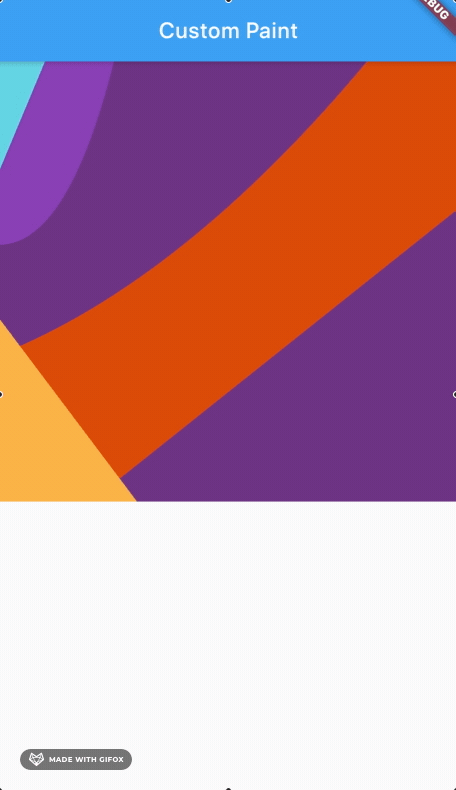

# custom_painter

## custom : - CustomPainter
 - colors
 - void paint(Canvas canvas, Size size) - canvas.drawPath(mainPathm paint)
 -  drawPaint = Path() 
 + addRect 
 + moveTo
 + quadraticBezierTo
 + lineTo
 
